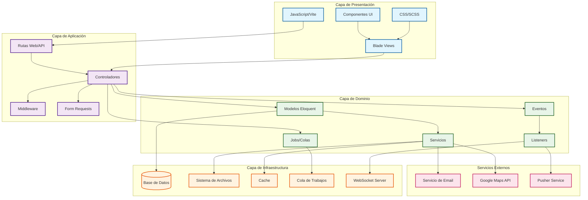
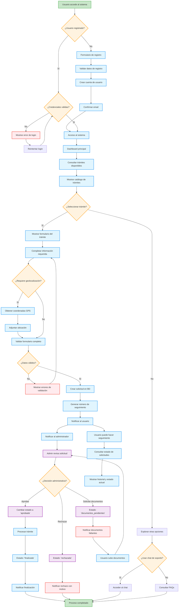
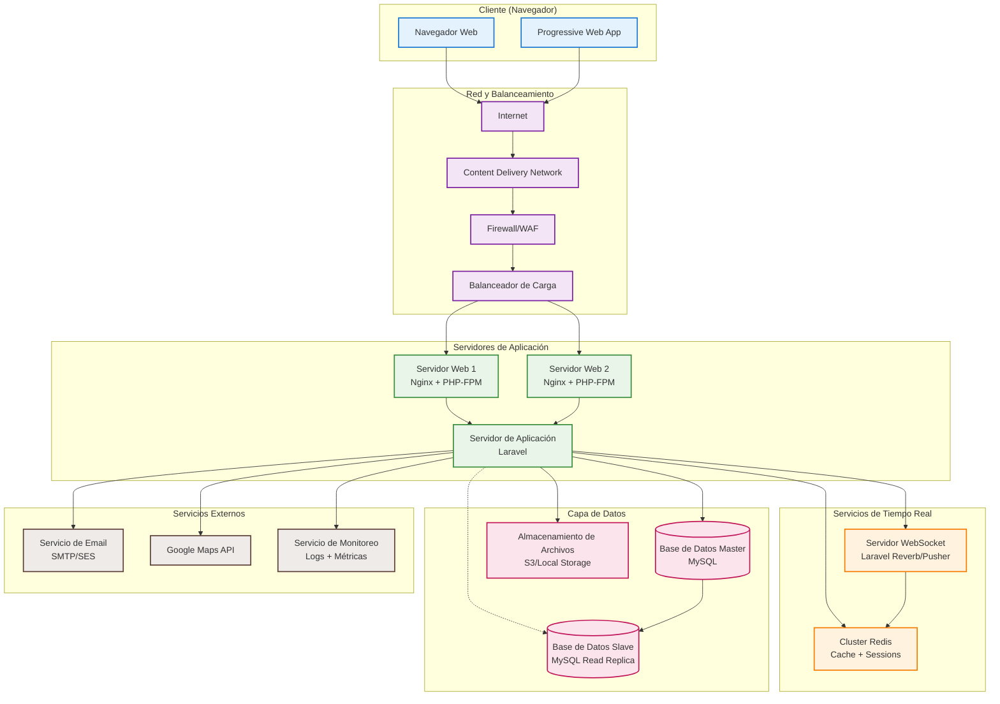
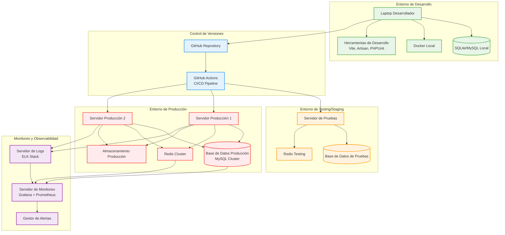
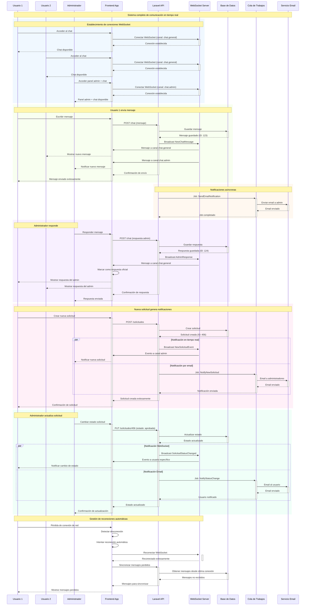

# MuniApp - Diagramas Complementarios para Tesis
## Diagramas Específicos de Componentes y Procesos

---

## 8. Diagrama de Clases - Modelos del Sistema

```mermaid
classDiagram
    class User {
        +Long id
        +String name
        +String email
        +DateTime email_verified_at
        +String password
        +String remember_token
        +DateTime created_at
        +DateTime updated_at
        +isAdmin() Boolean
        +solicitudes() Collection~Solicitud~
        +chats() Collection~Chat~
        +roles() Collection~Role~
    }

    class Tramite {
        +Long id
        +String nombre
        +String descripcion
        +DateTime created_at
        +DateTime updated_at
        +solicitudes() Collection~Solicitud~
    }

    class Solicitud {
        +Long id
        +Long user_id
        +Long tramite_id
        +JSON formulario
        +String detalles
        +String comentario
        +Decimal latitud
        +Decimal longitud
        +String estado
        +DateTime created_at
        +DateTime updated_at
        +user() User
        +tramite() Tramite
    }

    class Faq {
        +Long id
        +String pregunta
        +String respuesta
        +Boolean activo
        +Integer orden
        +String categoria
        +DateTime created_at
        +DateTime updated_at
        +scopeActivo() Builder
    }

    class Chat {
        +Long id
        +Long user_id
        +String message
        +String room
        +DateTime created_at
        +DateTime updated_at
        +user() User
    }

    class Role {
        +Long id
        +String name
        +String guard_name
        +DateTime created_at
        +DateTime updated_at
        +permissions() Collection~Permission~
        +users() Collection~User~
    }

    class Permission {
        +Long id
        +String name
        +String guard_name
        +DateTime created_at
        +DateTime updated_at
        +roles() Collection~Role~
    }

    %% Relaciones
    User ||--o{ Solicitud : "tiene muchas"
    Tramite ||--o{ Solicitud : "genera muchas"
    User ||--o{ Chat : "envía muchos"
    User }o--o{ Role : "tiene roles"
    Role }o--o{ Permission : "tiene permisos"

    %% Estilos
    classDef userClass fill:#e3f2fd,stroke:#1976d2,stroke-width:2px
    classDef businessClass fill:#f3e5f5,stroke:#7b1fa2,stroke-width:2px
    classDef systemClass fill:#e8f5e8,stroke:#388e3c,stroke-width:2px

    class User userClass
    class Tramite,Solicitud,Faq,Chat businessClass
    class Role,Permission systemClass
```

---

## 9. Diagrama de Componentes - Arquitectura Laravel



---

## 10. Diagrama de Flujo - Proceso Completo de Gestión de Trámites



---

## 11. Diagrama de Red - Infraestructura del Sistema



---

## 12. Diagrama de Despliegue - Entornos del Sistema



---

## 13. Diagrama de Tiempo Real - Chat y Notificaciones



---

## Métricas y KPIs del Sistema

### Métricas Técnicas:
- **Tiempo de respuesta promedio**: < 200ms para consultas básicas
- **Disponibilidad del sistema**: 99.9% uptime objetivo
- **Conexiones WebSocket concurrentes**: Hasta 1000 usuarios simultáneos
- **Throughput de base de datos**: 500 transacciones por segundo
- **Tiempo de reconexión**: < 5 segundos automático

### Métricas de Negocio:
- **Solicitudes procesadas**: Seguimiento diario/mensual
- **Tiempo promedio de resolución**: Por tipo de trámite
- **Satisfacción del usuario**: Métricas de uso del chat y FAQs
- **Adopción del sistema**: Usuarios activos vs registrados
- **Eficiencia administrativa**: Tiempo de procesamiento de solicitudes

---

*Documentación técnica completa para tesis universitaria*  
*Sistema MuniApp - Plataforma de Gestión Municipal Digital*
