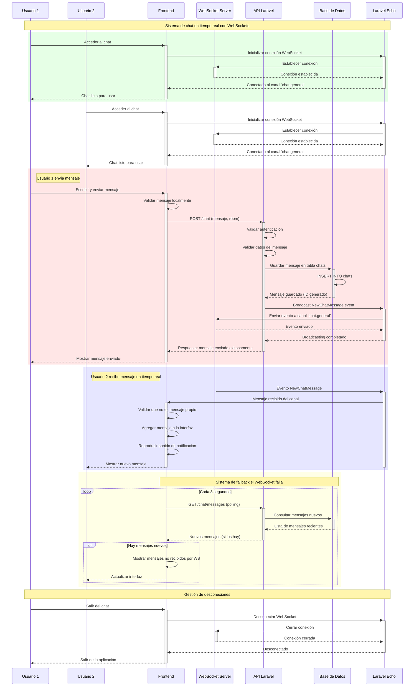
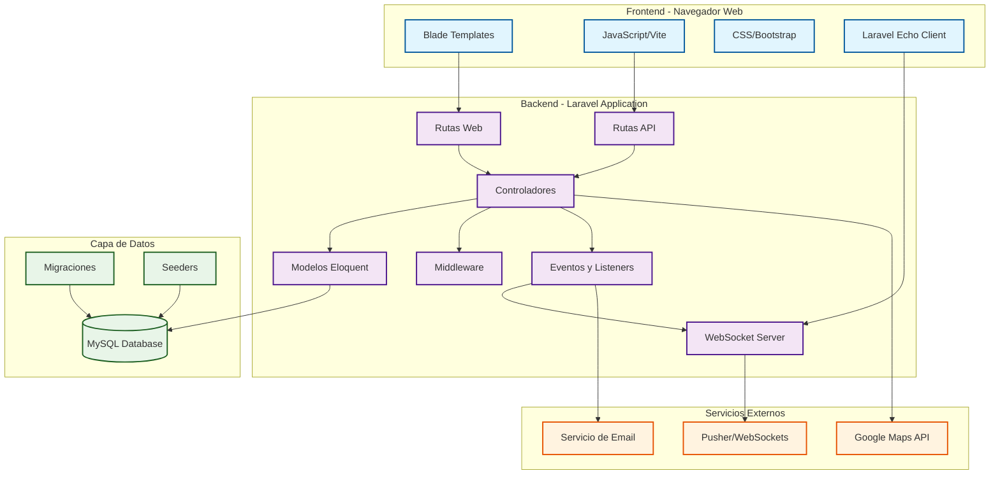
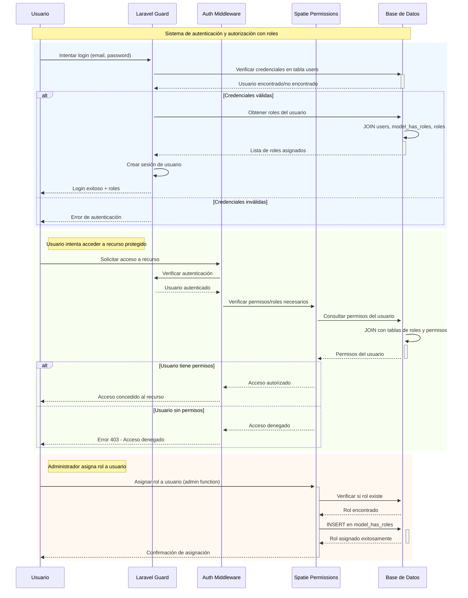
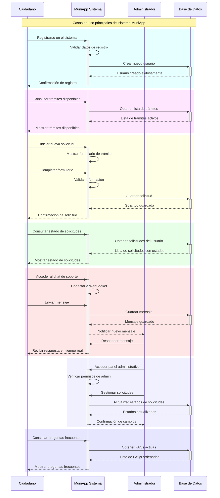
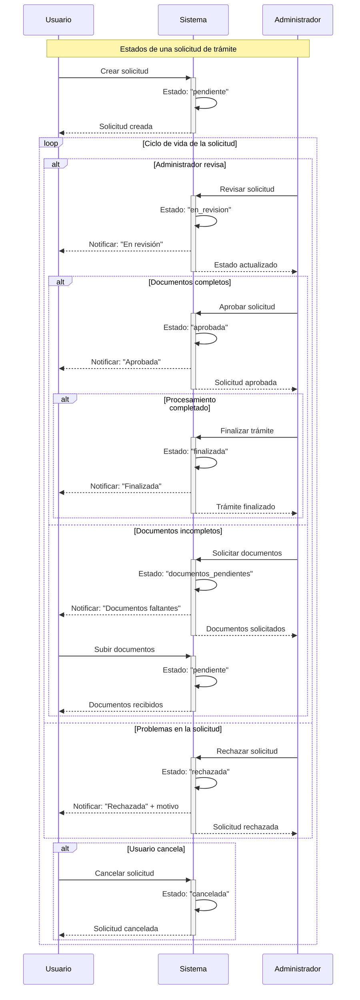

# MuniApp - Diagramas de Base de Datos y Arquitectura
## Sistema de Gestión Municipal - Tesis Universitaria

Este documento contiene diagramas profesionales del sistema MuniApp desarrollado en Laravel, incluyendo diagramas de entidad-relación, diagramas de secuencia, y arquitectura del sistema.

---

## 1. Diagrama de Entidad-Relación (ERD) - Base de Datos Principal

```mermaid
---
title: "MuniApp - Modelo de Base de Datos"
---
erDiagram
    %% Tabla de Usuarios
    USERS {
        bigint id PK "Identificador único del usuario"
        string name "Nombre completo del usuario"
        string email UK "Correo electrónico único"
        timestamp email_verified_at "Fecha de verificación de email"
        string password "Contraseña encriptada"
        string remember_token "Token de recordar sesión"
        timestamp created_at "Fecha de creación"
        timestamp updated_at "Fecha de actualización"
    }

    %% Tabla de Trámites
    TRAMITES {
        bigint id PK "Identificador único del trámite"
        string nombre "Nombre descriptivo del trámite"
        text descripcion "Descripción detallada del trámite"
        timestamp created_at "Fecha de creación"
        timestamp updated_at "Fecha de actualización"
    }

    %% Tabla de Solicitudes
    SOLICITUDES {
        bigint id PK "Identificador único de la solicitud"
        bigint user_id FK "Referencia al usuario solicitante"
        bigint tramite_id FK "Referencia al trámite solicitado"
        json formulario "Datos del formulario en formato JSON"
        string detalles "Detalles adicionales de la solicitud"
        text comentario "Comentarios del usuario"
        decimal latitud "Coordenada de latitud para ubicación"
        decimal longitud "Coordenada de longitud para ubicación"
        string estado "Estado actual de la solicitud"
        timestamp created_at "Fecha de creación"
        timestamp updated_at "Fecha de actualización"
    }

    %% Tabla de FAQs
    FAQS {
        bigint id PK "Identificador único de la pregunta"
        string pregunta "Pregunta frecuente"
        text respuesta "Respuesta a la pregunta"
        boolean activo "Indica si está activa o no"
        integer orden "Orden de visualización"
        string categoria "Categoría de la pregunta"
        timestamp created_at "Fecha de creación"
        timestamp updated_at "Fecha de actualización"
    }

    %% Tabla de Chat
    CHATS {
        bigint id PK "Identificador único del mensaje"
        bigint user_id FK "Referencia al usuario que envía"
        string message "Contenido del mensaje"
        string room "Sala de chat (por defecto: general)"
        timestamp created_at "Fecha de creación"
        timestamp updated_at "Fecha de actualización"
    }

    %% Tabla de Roles (Sistema de Permisos)
    ROLES {
        bigint id PK "Identificador único del rol"
        string name "Nombre del rol"
        string guard_name "Nombre del guardian"
        timestamp created_at "Fecha de creación"
        timestamp updated_at "Fecha de actualización"
    }

    %% Tabla de Permisos
    PERMISSIONS {
        bigint id PK "Identificador único del permiso"
        string name "Nombre del permiso"
        string guard_name "Nombre del guardian"
        timestamp created_at "Fecha de creación"
        timestamp updated_at "Fecha de actualización"
    }

    %% Tabla de Relación Usuario-Rol
    MODEL_HAS_ROLES {
        bigint role_id PK,FK "Referencia al rol"
        string model_type PK "Tipo de modelo (User)"
        bigint model_id PK,FK "ID del modelo (user_id)"
    }

    %% Tabla de Relación Rol-Permiso
    ROLE_HAS_PERMISSIONS {
        bigint permission_id PK,FK "Referencia al permiso"
        bigint role_id PK,FK "Referencia al rol"
    }

    %% Relaciones principales
    USERS ||--o{ SOLICITUDES : "realiza"
    TRAMITES ||--o{ SOLICITUDES : "genera"
    USERS ||--o{ CHATS : "envía"
    
    %% Relaciones del sistema de permisos
    ROLES ||--o{ MODEL_HAS_ROLES : "asignado_a"
    USERS ||--o{ MODEL_HAS_ROLES : "tiene"
    PERMISSIONS ||--o{ ROLE_HAS_PERMISSIONS : "incluye"
    ROLES ||--o{ ROLE_HAS_PERMISSIONS : "contiene"

    %% Estilos para mayor claridad
    classDef primaryEntity fill:#e1f5fe,stroke:#01579b,stroke-width:2px
    classDef businessEntity fill:#f3e5f5,stroke:#4a148c,stroke-width:2px
    classDef systemEntity fill:#e8f5e8,stroke:#1b5e20,stroke-width:2px
    classDef relationEntity fill:#fff3e0,stroke:#e65100,stroke-width:2px

    class USERS,TRAMITES,SOLICITUDES primaryEntity
    class FAQS,CHATS businessEntity
    class ROLES,PERMISSIONS systemEntity
    class MODEL_HAS_ROLES,ROLE_HAS_PERMISSIONS relationEntity
```



---

## 2. Diagrama de Secuencia - Proceso de Solicitud de Trámite

```mermaid
sequenceDiagram
    participant C as Ciudadano
    participant W as Aplicación Web
    participant A as Autenticación
    participant DB as Base de Datos
    participant N as Sistema de Notificaciones
    participant Admin as Administrador

    Note over C,Admin: Flujo completo de solicitud de trámite municipal

    %% Inicio de sesión
    C->>+W: Accede a la aplicación
    W->>+A: Verificar autenticación
    alt Usuario no autenticado
        A-->>W: Usuario no autenticado
        W-->>C: Redirigir a login
        C->>W: Completar formulario de login
        W->>A: Validar credenciales
        A->>+DB: Verificar usuario/contraseña
        DB-->>-A: Credenciales válidas
        A-->>-W: Autenticación exitosa
    else Usuario autenticado
        A-->>-W: Usuario autenticado
    end

    %% Selección de trámite
    W-->>-C: Mostrar dashboard principal
    C->>+W: Navegar a sección de trámites
    W->>+DB: Obtener lista de trámites disponibles
    DB-->>-W: Lista de trámites
    W-->>-C: Mostrar trámites disponibles

    C->>+W: Seleccionar trámite específico
    W->>+DB: Obtener detalles del trámite
    DB-->>-W: Detalles y formulario del trámite
    W-->>-C: Mostrar formulario de solicitud

    %% Completar solicitud
    rect rgb(200, 255, 200)
    Note right of C: Proceso de completar solicitud
    C->>+W: Completar formulario de solicitud
    C->>W: Agregar ubicación (GPS)
    C->>W: Agregar comentarios adicionales
    C->>W: Enviar solicitud
    end

    %% Validación y procesamiento
    W->>+W: Validar datos del formulario
    alt Datos válidos
        W->>+DB: Crear nueva solicitud
        activate DB
        DB->>DB: Insertar en tabla solicitudes
        DB->>DB: Relacionar con usuario y trámite
        DB-->>W: Solicitud creada (ID generado)
        deactivate DB
        
        %% Notificación al usuario
        W->>+N: Generar notificación de confirmación
        N-->>-C: "Solicitud enviada correctamente"
        
        %% Notificación al administrador
        W->>+N: Notificar nueva solicitud a admin
        N-->>Admin: "Nueva solicitud pendiente de revisión"
        
        W-->>-C: Mostrar mensaje de éxito
    else Datos inválidos
        W-->>C: Mostrar errores de validación
        C->>W: Corregir datos
    end

    %% Seguimiento de la solicitud
    Note over C,Admin: El ciudadano puede hacer seguimiento

    C->>+W: Ver estado de solicitudes
    W->>+DB: Consultar solicitudes del usuario
    DB-->>-W: Lista de solicitudes con estado
    W-->>-C: Mostrar historial de solicitudes

    %% Procesamiento por parte del administrador
    rect rgb(255, 200, 200)
    Note right of Admin: Proceso administrativo
    Admin->>+W: Revisar solicitudes pendientes
    W->>+DB: Obtener solicitudes pendientes
    DB-->>-W: Lista de solicitudes
    W-->>Admin: Mostrar panel de administración

    Admin->>+W: Actualizar estado de solicitud
    W->>+DB: Actualizar estado en base de datos
    DB-->>-W: Estado actualizado
    
    W->>+N: Notificar cambio de estado al ciudadano
    N-->>-C: "Su solicitud ha sido actualizada"
    W-->>-Admin: Confirmación de actualización
    end
```

---

## 3. Diagrama de Secuencia - Sistema de Chat en Tiempo Real



---

## 4. Diagrama de Arquitectura del Sistema



---

## 5. Diagrama de Flujo - Autenticación y Autorización



---

## 6. Diagrama de Casos de Uso del Sistema



---

## 7. Diagrama de Estados - Ciclo de Vida de una Solicitud



---

## Conclusiones Técnicas

### Características del Sistema:
- **Arquitectura MVC** con Laravel Framework
- **Sistema de autenticación** robusto con roles y permisos
- **Comunicación en tiempo real** mediante WebSockets
- **Geolocalización** para solicitudes con coordenadas GPS
- **API RESTful** para comunicación cliente-servidor
- **Base de datos relacional** bien estructurada
- **Sistema de notificaciones** para usuarios y administradores

### Tecnologías Implementadas:
- **Backend**: Laravel 10+, PHP 8+
- **Frontend**: Blade Templates, JavaScript ES6+, Bootstrap 5
- **Base de Datos**: MySQL con migraciones de Eloquent
- **Tiempo Real**: Laravel Echo, Pusher, WebSockets
- **Autenticación**: Laravel Guards, Spatie Permissions
- **Build Tools**: Vite para empaquetado de assets

### Patrones de Diseño Utilizados:
- **Repository Pattern** mediante Eloquent Models
- **Observer Pattern** con Events y Listeners
- **Middleware Pattern** para autenticación y autorización
- **MVC Pattern** para separación de responsabilidades
- **Active Record Pattern** con Eloquent ORM

---

*Diagramas generados con Mermaid.js para documentación de tesis universitaria*
*Sistema MuniApp - Gestión Municipal Digital*
